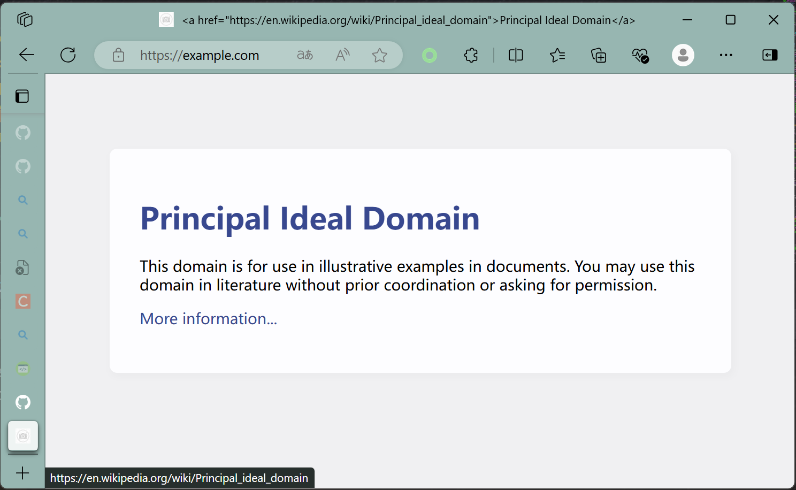
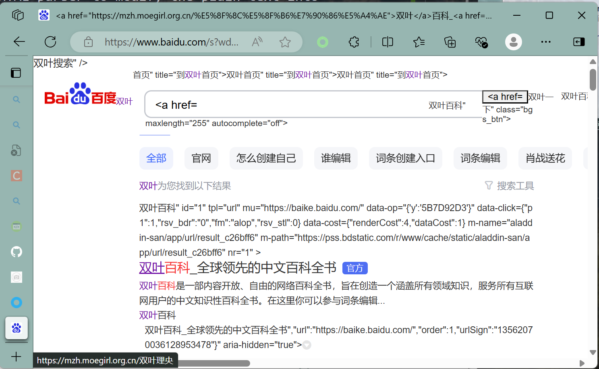

# MITM for HTTP and HTTPS

A demo for HTTP- and TLS- hijack

Using `address::port` in socks5 proxy to route HTTP and HTTPS traffic
, and hijack.

In HTTP, we remove the `Accept-Encoding` header.

In HTTPS, we trust a self-signed certificate.

Trying to use HTML parser to modify the plain-text into link, but failed to some extent.

However,

